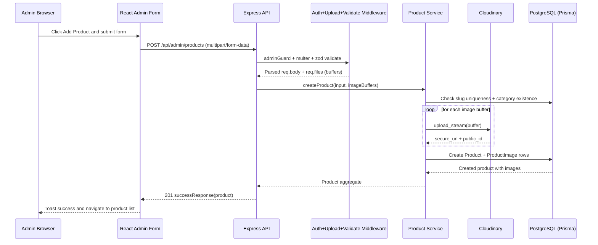
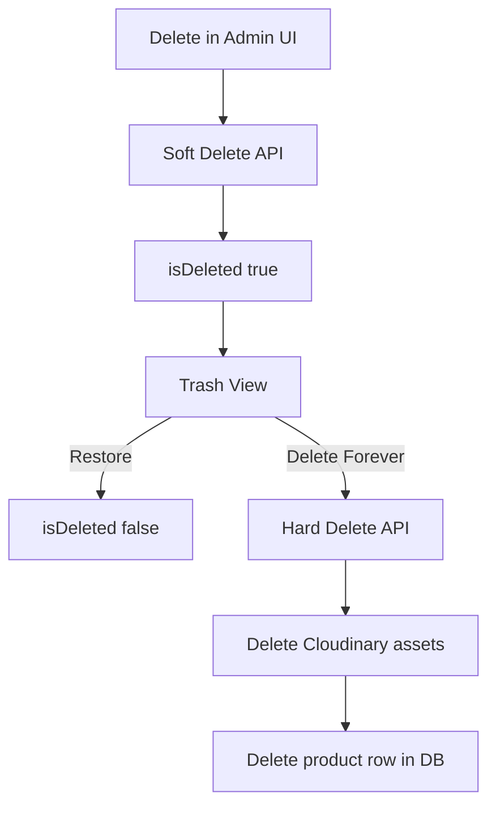

# Admin Panel Product Management: End-to-End Flow

## 1) System Overview

This project uses a decoupled architecture:

- Frontend: React + Vite + TypeScript
- Backend: Node.js + Express + TypeScript
- Database: PostgreSQL via Prisma ORM
- Image Storage/CDN: Cloudinary (served via secure CDN URLs)
- Auth: JWT access tokens + httpOnly refresh cookie

For product management, the critical path is:

1. Admin UI creates multipart form data
2. Backend validates admin auth + request payload
3. Backend uploads image buffers directly to Cloudinary
4. Backend writes product + product_images rows in PostgreSQL
5. Frontend receives product object with Cloudinary URLs and renders images directly from URL

---

## 2) High-Level Architecture and Folder Map

### Frontend (product/admin)

- frontend/src/pages/admin/AdminProductsPage.tsx
  - Product listing, trash view, delete/restore, bulk actions, export
- frontend/src/pages/admin/AdminProductFormPage.tsx
  - Add/edit form, file selection, FormData creation
- frontend/src/api/index.ts
  - Admin and public API wrappers
- frontend/src/lib/api.ts
  - Axios instance, auth header injection, refresh-token retry flow
- frontend/src/pages/ProductsPage.tsx
  - Public product catalog fetch
- frontend/src/pages/ProductDetailPage.tsx
  - Product details + image gallery rendering

### Backend (product/admin)

- backend/src/server.ts
  - Route mounting, middleware stack, CORS, helmet
- backend/src/routes/adminRoutes.ts
  - Admin-protected product CRUD routes
- backend/src/routes/productRoutes.ts
  - Public product read routes
- backend/src/controllers/adminController.ts
  - HTTP handling for admin product operations
- backend/src/controllers/productController.ts
  - HTTP handling for public product operations
- backend/src/services/productService.ts
  - Core business logic, Prisma operations, Cloudinary calls
- backend/src/middleware/auth.ts
  - adminGuard and token verification
- backend/src/middleware/upload.ts
  - Multer memory storage + image constraints
- backend/src/middleware/validate.ts
  - Zod validation middleware
- backend/src/middleware/errorHandler.ts
  - Centralized error response handling
- backend/src/utils/cloudinary.ts
  - Cloudinary upload/delete wrappers
- backend/src/utils/validators.ts
  - Zod schemas for create/update/query/bulk actions
- backend/prisma/schema.prisma
  - Product and ProductImage data model definitions

---

## 3) Database Model (How Data Is Stored)

### Product table (model Product)

Stores core catalog fields:

- id, name, slug, description
- price, originalPrice
- categoryId (FK to Category)
- status (ACTIVE, INACTIVE, OUT_OF_STOCK)
- tags (string array)
- isDeleted, deletedAt (soft-delete support)
- createdAt, updatedAt

### ProductImage table (model ProductImage)

Stores image metadata linked to Product:

- id
- productId (FK to Product, cascade delete)
- url (Cloudinary secure URL)
- cdnPublicId (Cloudinary public identifier, needed for delete)
- displayOrder
- isPrimary
- createdAt

### Relationship

- One Product has many ProductImage records
- Product.images is included in product queries and sorted by displayOrder

---

## 4) Security and Authentication Flow (Admin Access)

## Token model

- Admin logs in via POST /api/auth/admin/login
- Backend returns:
  - accessToken in JSON response (admin token lifetime is 8h)
  - refreshToken in httpOnly cookie

### Route protection

- All /api/admin/* routes use adminGuard middleware
- adminGuard checks:
  1. Authorization header exists and starts with Bearer
  2. JWT validity/signature
  3. role === ADMIN
  4. admin exists in database

If any check fails, request is rejected with 401/403.

### Frontend token behavior

- Axios interceptor in frontend/src/lib/api.ts:
  - Injects adminAccessToken for /admin calls
  - On 401, attempts POST /auth/refresh using cookie
  - Retries failed request with new access token
  - Logs out and redirects if refresh fails

---

## 5) What Happens When Admin Clicks Add Product

## UI action path

1. Admin opens /admin/products/add
2. Admin fills fields and selects image files
3. On submit, AdminProductFormPage builds FormData with:
   - name, description, price, originalPrice, categoryId, status, tags
   - one or more images files under the key images
4. Frontend calls adminApi.createProduct(formData)
5. Axios sends multipart/form-data to POST /api/admin/products with Bearer admin token

## Backend request path

1. Route: POST /api/admin/products
2. Middleware order:
   - adminGuard (authz/authn)
   - upload.array(images, 10) (Multer parses file streams)
   - validate(createProductSchema) (Zod body validation)
3. Controller converts req.files to imageBuffers
4. Service createProduct executes:
   - slug generation from product name
   - slug uniqueness check
   - category existence check
   - image upload loop to Cloudinary
   - Prisma create for Product and nested ProductImage rows
5. Response returns created product with category + images

---

## 6) Image Upload, Storage, and URL Generation

## Where images are stored

- Not stored on local disk permanently
- Not stored in database as binary blobs
- Uploaded from in-memory Multer buffers to Cloudinary
- Cloudinary hosts files and serves via CDN-backed secure URLs

## Upload mechanics

- upload.ts uses Multer memoryStorage
- File constraints:
  - Allowed mime types: image/jpeg, image/png, image/webp
  - Max per file: 5 MB
  - Max files: 10
- cloudinary.ts upload options:
  - folder: products (default)
  - resource_type: image
  - format: webp
  - quality: auto

## URL and linkage

For each image upload, Cloudinary returns:

- secure_url -> saved as ProductImage.url
- public_id -> saved as ProductImage.cdnPublicId

This creates a durable link:

- ProductImage.productId connects image to product
- ProductImage.url is directly used by frontend img src
- ProductImage.cdnPublicId is used for future delete/update operations

---

## 7) APIs Involved in Product Management

### Admin Product APIs

- GET /api/admin/products
  - Admin listing with search/sort/pagination
- GET /api/admin/products/trash
  - Soft-deleted products only
- POST /api/admin/products
  - Create product + upload images
- PUT /api/admin/products/:id
  - Update fields + add/remove/reorder images
- DELETE /api/admin/products/:id
  - Soft delete (move to trash)
- POST /api/admin/products/:id/restore
  - Restore soft-deleted product
- DELETE /api/admin/products/:id/hard
  - Permanent delete (requires soft-deleted state first)
- POST /api/admin/products/bulk
  - Bulk action: delete, activate, deactivate
- GET /api/admin/products/export
  - CSV export

### Public Product APIs

- GET /api/products
  - Public catalog (ACTIVE + not deleted)
- GET /api/products/:slug
  - Product detail
- GET /api/products/latest
  - Latest active products
- GET /api/products/discounted
  - Active products with originalPrice present
- GET /api/products/search?q=...
  - Search endpoint

---

## 8) Complete Frontend -> Backend -> DB -> Storage Flow (Create)

---

## 9) Validation and Error Handling Flow

## Frontend validation

AdminProductFormPage validates before submit:

- name required, minimum 2 chars
- description required and non-empty plain text
- price required
- category required
- file picker restricts accepted image mime types

## Backend validation

- Zod createProductSchema and updateProductSchema enforce:
  - name length
  - description minimum length
  - positive price/originalPrice
  - required categoryId
  - valid status enum
  - tags parsing from comma-separated string to array
- Multer enforces file size/count/type constraints

## Error response handling

- Known AppError classes map to clean status codes (400/401/403/404/409/429)
- Zod errors return 400 with field-level combined message
- Unhandled errors are logged and return 500 (production message is generic)
- Frontend axios layer shows global toast for non-401 errors
- Product form shows localized toast from server error when available

---

## 10) Product Edit, Update, Delete, Restore, Hard Delete

## Edit/Update flow

1. Admin opens /admin/products/:id/edit
2. Form loads product data (currently fetched through admin listing, then matched by id)
3. Admin can:
   - update text/price/status/category/tags
   - remove existing images (send removeImageIds)
   - upload new images
   - send imageOrder for display ordering and primary flag
4. PUT /api/admin/products/:id with multipart/form-data
5. Service updateProduct executes:
   - verifies product exists and not deleted
   - checks slug conflicts if name changed
   - deletes removed images from Cloudinary + DB
   - uploads new images to Cloudinary + inserts rows
   - applies image order updates
   - updates product fields

## Soft delete

- DELETE /api/admin/products/:id
- Sets isDeleted=true and deletedAt timestamp
- Product hidden from public and regular admin list
- Visible in trash endpoint

## Restore

- POST /api/admin/products/:id/restore
- Sets isDeleted=false and deletedAt=null

## Hard delete

- DELETE /api/admin/products/:id/hard
- Allowed only if already soft-deleted
- Deletes all Cloudinary assets using cdnPublicId
- Deletes product row (and cascades ProductImage rows)

---

## 11) How Products and Images Reach End Users

## Public fetch logic

- ProductsPage calls GET /api/products with optional filters
- ProductDetailPage calls GET /api/products/:slug
- HomePage calls latest and discounted endpoints

## Backend filter logic for public APIs

Public reads only return products where:

- isDeleted = false
- status = ACTIVE

Each product query includes images relation and sorted display order.

## Frontend rendering

- Product cards and details choose primary image first (fallback to first image)
- Image src is directly ProductImage.url (Cloudinary secure URL)
- UI includes fallback placeholder on image load error

This means there is no image proxy layer in the app path: the browser requests Cloudinary URLs directly.

---

## 12) Production-Readiness and Scalability Notes

### Existing strong points

- Clear separation: routes -> controllers -> services -> Prisma
- Soft-delete lifecycle support
- CDN-based image hosting with public_id tracking
- Structured auth middleware and admin role checks
- Centralized error handling and validation middleware
- Pagination for admin and public listings

### Recommended enhancements for scale

1. Add dedicated GET /api/admin/products/:id endpoint
   - Current edit page fetches list and searches by id; direct endpoint is cleaner and faster.
2. Make create/update product image uploads transactional with compensation
   - If DB write fails after cloud upload, schedule rollback delete for uploaded assets.
3. Move image upload to async queue for large batches
   - Useful when image count/size grows significantly.
4. Add idempotency keys for admin create/update endpoints
   - Prevent duplicate products on retried requests.
5. Add audit log table for admin product operations
   - Track who changed what and when.
6. Add signed Cloudinary upload option if shifting upload directly from frontend in future
   - Reduces backend bandwidth load.

---

## 13) Step-by-Step Example: Add Product (Concrete)

## Request example (frontend FormData)

Fields:

- name: Premium Kurti
- description: rich HTML from editor
- price: 1499
- originalPrice: 1999
- categoryId: cat_123
- status: ACTIVE
- tags: ethnic, women, festive
- images: 1..10 files

## Processing summary

1. adminGuard authorizes ADMIN JWT.
2. Multer parses images into memory buffers.
3. Zod validates and normalizes payload.
4. Service checks slug/category, uploads images to Cloudinary.
5. Service creates Product and ProductImage rows.
6. API returns created product payload with image URLs.
7. Admin list refresh displays new product image from URL immediately.

---

## 14) End-to-End Data Contracts (Simplified)

## Create success response shape

- success: true
- data:
  - product core fields
  - category object
  - images[] with:
    - id
    - url
    - cdnPublicId
    - displayOrder
    - isPrimary

## Why this contract matters

- Frontend does not need to build image URLs manually.
- URL generation is delegated to Cloudinary and persisted once.
- cdnPublicId remains internal-but-available for backend mutation operations.

---

## 15) Final Mental Model

Think of product management as two linked records:

- Product = commercial/business data
- ProductImage = media metadata and CDN coordinates

The product row answers what to sell.
The image rows answer how to visually present it.
Cloudinary holds binary media, PostgreSQL holds references, and frontend renders those references directly.

This is a solid production pattern because it keeps database lean, media delivery fast, and admin workflows flexible.
